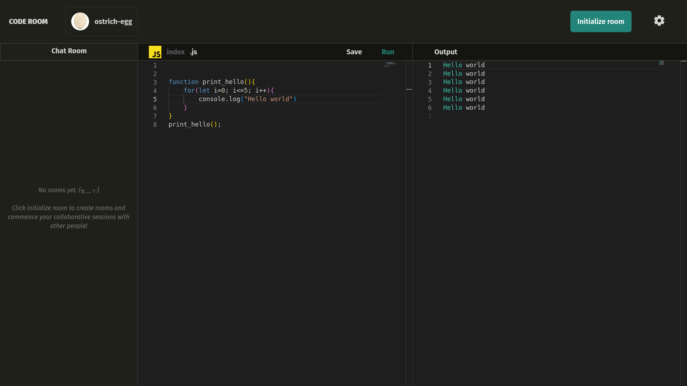

# CODE ROOM
Code Room is an unbelievably fast online code editor and compiler which allows you for real time collaboration.



### Features

- Support Multiple language code compilation.
- Uses Monaco Editor (the same that VS Code uses) for Indentation, Code Coloration, IntelliSense.
- Allows you to Code Collaborate with multiple uses in real time.
- Allows you to chat with your fellow collaborators.


### Get Started

*Make sure Node is installed on your machine*


```sh
git clone <link>
cd CodeRoom
```

**To start React App**
```sh
npm install
npm run dev
```

**To start server**
```sh
cd server
npm install
npm start
```

**On you favourite browser**
```
http://localhost:5173/
```
>voilà! You are ready to swing.

### Under the hood
- React  In front end
- Nodejs server on backend
- MySQL for Database Management
- Tailwind for Style
- Password Encryption using bcrypt hashing
- Authentication using JWT, with ft. like OTP using NodeMailer.
- Monaco Editor for code IntelliSense and edit
- Glot API for Code Compilation
- Socket.io for websocket (Real time communication)
- Some Common sense

### Before you Start

- **Server is running on port :``` 5001```**<br>

**Make sure your .env file inside directory server  looks something like this:**
```
#For MYSQL Database
DB_HOST = localhost
DB_USER = root
DB_PASS = <your password>
DB_NAME = users
DB_TABLE_NAME = userstable

#For OTP Database
DB_OTP_TABLE_NAME = otpverification
OTP_EMAIL_SENDER = <me@gmail.com>

#For OTP Nodemailer
OTP_APP_PASSWORD = <Application password>
OTP_EXPIRY = 5* #In mins

#For json web token
JWT_SECRET = <IHaveNoSecrets>
JWT_LIFETIME = '1hr'
```

### Developers

[Ostrich-egg](https://github.com/ostrich-egg)
[Adarsha](https://github.com/Adarsha16)
[Pranaya-sht](https://github.com/Pranaya-sht)
[XGPher35](https://github.com/XGPher35)
> This was Third semister project.